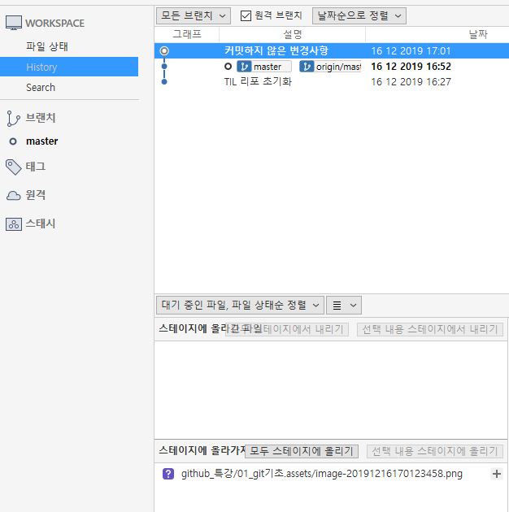

# Git 기초


오늘 배운 내용 블로그 정리

https://blog.naver.com/i___________i/221738956269


## SCM이란?

SourceCodeManager의 약자로, 코드 버전을 관리하기 위해 존재한다

## Git

git은 Linux Torvals가 만든 SCM으로, 현재 가장 많이 사용된다.

## Github

내용

| 명령어 | 설명   | 예시 |
| ------ | ------ | ---- |
| 내용   | 초기화 | 내용 |
| 내용   | 내용   | 내용 |

```C#
Spublic class
```


## Source Tree

